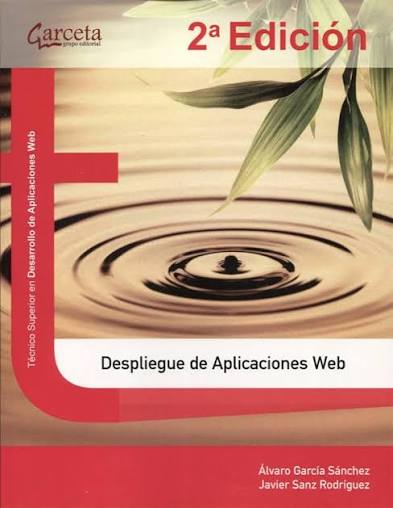

# Despliegue de aplicaciones web
`Curso 2026/2027`




## Introducción
Para desplegar una aplicación web vamos a necesitar una **infraestructura** que nos permita alojarla y hacerla accesible a los usuarios a través de Internet.

A continuación, se describen las opciones *más comunes* para desplegar una aplicación web.

<!-- Este texto es un comentario y no será renderizado -->

1. Hosting Compartido
2. VPS (Virtual Private Server)
3. Servidor Dedicado
4. Cloud Computing
5. Hosting estático con CDNs (Content Delivery Network)

| Opción | Ventajas | Desventajas 
| --- | --- |---
| Hosting Compartido |          |         |
| VPS                |          |         |
| Servidor Didicado  |          |         |
| Cloud Computing    |          |         |
| Hosting estático   |          |         |

Comandos Básicos  
 que vamos a usar

```bash
sudo apt update && sudo apt upgrade
```
Tipo de lenguajes   
utilizados

```python
celsius = float(input('Introduce una temperatura en grados Celsius: '))
farenheit = (1.8 * celsius) + 32
print(f'La temperatura en grados Farenheit es: {farenheit}')
```

## Prácticas
* Práctica 1
    * Ejercicio 1
    * Ejercicio 2
* Práctica 2
    * Ejercicio 1
    * Ejercicio 2
* Práctica 3
    * Ejercicio 1
    * Ejercicio 2
* Práctica 4
    * Ejercicio 1
    * Ejercicio 2

### Referencias
* [10 Best App Deployment Platforms][1]. Tapas Adhikary. 2022.
* [How to Deploy Your Websites and Apps – User-Friendly Deployment Strategies][2]. Ijeoma Igboagu. 2023.
* [Explora las 30 Mejores Herramientas de DevOps a Tener en Cuenta en 2024](https://kinsta.com/es/blog/herramientas-devops/). Amrita Pathak.

[1]: https://bugfender.com/blog/10-best-app-deployment-platforms/
[2]:https://www.freecodecamp.org/news/how-to-deploy-websites-and-applications/

> La automatización y la documentación son la clave para un despliegue eficiente en entornos de producción.

#### Licencia
##### Licencia
###### Licencia